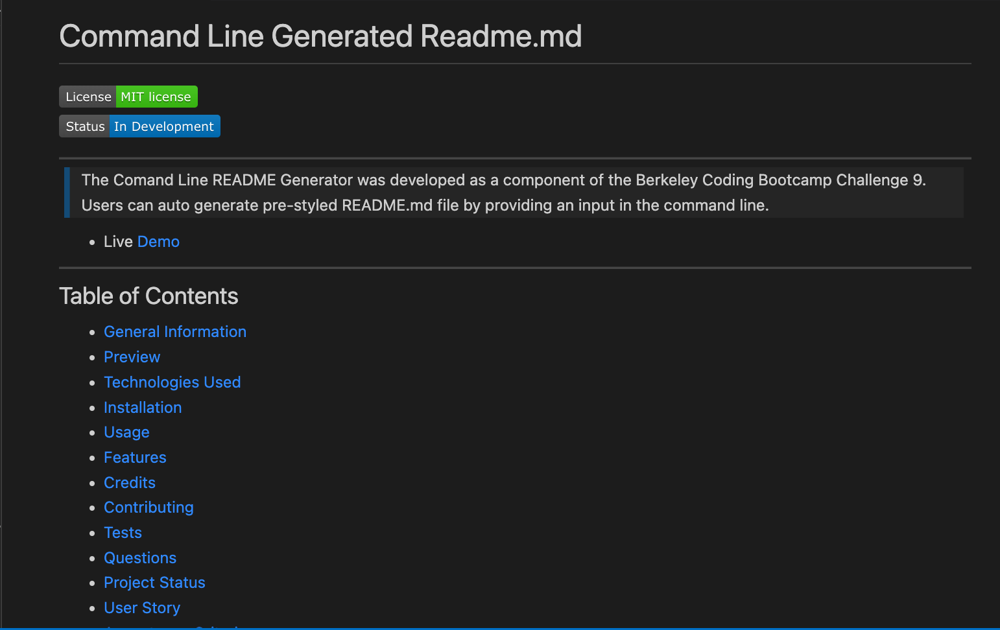
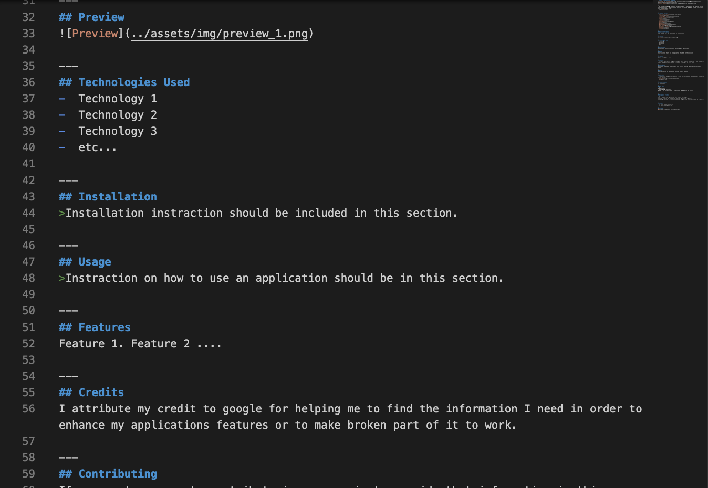

# Command Line Generated Readme.md 
[](https://opensource.org/licenses/MIT)    


--- 
> The Comand Line README Generator was developed as a component of the Berkeley Coding Bootcamp Challenge 9. Users can auto generate pre-styled README.md file by providing an input in the command line.
- The demo [README](./assets/demo.md) includes all the sections that the application can generate. Demo README is the unmodified version that was originally generated by the Command Line README Generator with user's command line input.
- The recorded [video](https://1drv.ms/v/s!Ak2qWe8ZT6ny2DkWOUDfeikHXf0u?e=EbrAEn) on the screen demonstrates how the README Generator operates.

---
## Table of Contents
* [General Information](#general-information)
* [Preview](#preview)
* [Technologies Used](#technologies-used)
* [Installation](#installation)
* [Usage](#usage)
* [Features](#features)
* [Credits](#credits)
* [Project Status](#project-status)
* [User Story](#user-story)
* [Acceptance Criteria](#acceptance-criteria)
* [Contact](#contact)
* [License](#license)

---
## General Information 
>The main purpose of Comand Line README file Generator is to enhance the user experience by allowing them to provide input about their software without having to worry about formatting or styling. The starter code was cloned from [coding-boot-camp](https://github.com/coding-boot-camp/potential-enigma) repository. The development of the application was done accordingly to [user story](#user-story) and [acceptance criteria](#acceptance-criteria). 

---
## Preview 
 

---
Raw README file

 

---
## Technologies Used
-  JavaScript
-  Node.js v18.12.1
-  Inquirer v8.2.4

---
## Installation
>To use the Comand Line README Generator, the user must first [clone](https://github.com/UserOlena/command-line-readme-generator) or [download](https://github.com/UserOlena/command-line-readme-generator/archive/refs/heads/main.zip) the repository to their local computer. Once the repository is successfully located on the computer, the user must install the necessary packages for the application to function. It is essential to have `node.js` installed on the computer, which can be downloaded from the official [web-site](https://nodejs.org/en). It is recommended to download `Node.js v18.12.1` since this application has only been tested with that version. Once `Node.js v18.12.1` is installed, the user should navigate to the `develop` directory within the repository using the command line by typing `cd ~/...` and replacing `...` with the path to the `develop` directory. Once in that directory, type `npm init -y` in the command line to install `node` modules and `npm i inquirer@8.2.4` to install the `inquirer` package. It is crucial to ensure that packages are installed within the `develop` directory, where `index.js` is located. Finally, the user can call the application by typing `node index` in the command line.

---
## Usage
- To utilize the Command Line README Generator, it is necessary to complete all the steps outlined in the Installation section.
- After completing the installation steps, the user can access the Command Line README Generator by navigating through the command line to the `develop` directory where all the necessary `node` modules, the `inquirer` package, and the `index.js` file are located. They can then call the application by typing `node index` in the command line.
- When the user types `node index` in the command line and runs the Command Line README Generator, the application will prompt them for input and their choice using a series of prompts.
- The Command Line README Generator requires input from the user for certain sections in the README, including title, description, installation, usage, and license. The application will not advance to the next question until the user has provided their input for these sections.
- In addition to the required sections, the Command Line README Generator also includes optional sections. When the user runs the application and is prompted for input, they will be asked if they would like to include these optional sections in their README. If the user enters `y` for `yes` or presses the `return` key on the keyboard, then the application will require input for that particular section as well. However, if the user enters `n` for `no`, then the application will skip that section and move on to the next prompt.
- Once all prompts have been completed and the user has provided input for all required and optional sections, the Command Line README Generator will generate and style most of the `README.md` file content based on the user's choices and inputs.
- After the README file has been generated, it will be automatically added to the `develop` directory where the `node_modules`, `inquirer`, and `index.js` files are located. The user can then open the file to check its final look or relocate the file to another directory as desired.
- It's important to note that each time the user runs the Command Line README Generator, the previously generated `README.md` file will be overwritten. To avoid losing important information that was provided during the prompts, the user must ensure to save the file before starting to generate another `README.md` file.

---
## Features 
- The Command Line README Generator will automatically apply pre-defined styling to most of the README content.
- The application includes a validation feature to ensure that all required sections have received user input. It will not proceed to the next prompt until the user provides input for these required sections.
- The application provides the user with the option to include non-mandatory sections in the README. If the user chooses to include a specific section, input is required to avoid having a section title without any content. However, if the user chooses not to include a particular section, no input is required, and the application will not add that section to the README, keeping the file organized and neat.
- If the user chooses not to include a particular section in their README.md file, the Command Line README Generator will not include the title of that section in the file, rather than leaving the title with no content.
- The application will generate a badge based on the user's project status choice and include it in the README.md file.
- If the user chooses to include the Questions section, the application will prompt them to provide their GitHub username. The generated README will then include a clickable link to that user's GitHub account. This link will allow anyone reading the README to easily navigate to the user's GitHub profile and view their repositories and other information. However, it is important to note that the link will only work if the user has provided a valid GitHub username.
- When the user selects a license from the list of options, the application will include a license badge with that license type under the main title at the top of the `README.md` file. The license badge will be clickable and will redirect the user to a description of that particular license type.
- If the user chooses not to include a particular section in the README.md file, the Command Line README Generator will remove that section from the generated file and ensure that there are no empty lines left behind, so that the file remains neat and organized with only one empty line between each section. 

---
## Credits 
I would like to express my gratitude to [shields.io](https://shields.io/) and [lukas-h](https://gist.github.com/lukas-h/2a5d00690736b4c3a7ba) for creating and sharing license bages.

---
## Project Status 
>Project is: Complete 

---
## User Story
```md
AS A developer
I WANT a README generator
SO THAT I can quickly create a professional README for a new project
```  

---
## Acceptance Criteria
```md
GIVEN a command-line application that accepts user input
WHEN I am prompted for information about my application repository
THEN a high-quality, professional README.md is generated with the title of my project and sections entitled Description, Table of Contents, Installation, Usage, License, Contributing, Tests, and Questions
WHEN I enter my project title
THEN this is displayed as the title of the README
WHEN I enter a description, installation instructions, usage information, contribution guidelines, and test instructions
THEN this information is added to the sections of the README entitled Description, Installation, Usage, Contributing, and Tests
WHEN I choose a license for my application from a list of options
THEN a badge for that license is added near the top of the README and a notice is added to the section of the README entitled License that explains which license the application is covered under
WHEN I enter my GitHub username
THEN this is added to the section of the README entitled Questions, with a link to my GitHub profile
WHEN I enter my email address
THEN this is added to the section of the README entitled Questions, with instructions on how to reach me with additional questions
WHEN I click on the links in the Table of Contents
THEN I am taken to the corresponding section of the README
```  

---
## Contact
-  [Olena P](https://github.com/UserOlena)

---
## License
>This project is open source and available under the [MIT](./LICENSE)
