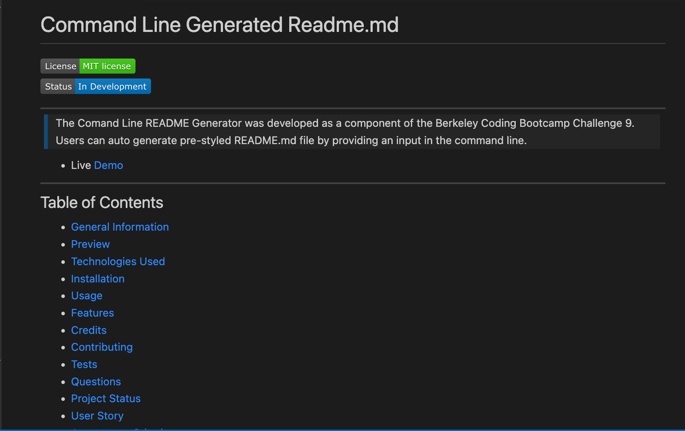

# Command Line Generated Readme.md  
[](https://opensource.org/licenses/MIT)    


--- 
> The Comand Line README Generator was developed as a component of the Berkeley Coding Bootcamp Challenge 9. Users can auto generate pre-styled README.md file by providing an input in the command line.
- Live [Demo](../assets/demo.md)

---
## Table of Contents
* [General Information](#general-information)
* [Preview](#preview)
* [Technologies Used](#technologies-used)
* [Installation](#installation)
* [Usage](#usage)
* [Features](#features)
* [Credits](#credits)
* [Contributing](#contributing)
* [Tests](#tests)
* [Questions](#questions)
* [Project Status](#project-status)
* [User Story](#user-story)
* [Acceptance Criteria](#acceptance-criteria)
* [Contact](#contact)
* [License](#license)

---
## General Information 
>Some general info can be included in this section 

---
## Preview 
 

---
## Technologies Used
-  Technology 1
-  Technology 2
-  Technology 3
-  etc...

---
## Installation
>Installation instraction should be included in this section.

---
## Usage
>Instraction on how to use an application should be in this section.

---
## Features 
Feature 1. Feature 2 ....  

---
## Credits 
I attribute my credit to google for helping me to find the information I need in order to enhance my applications features or to make broken part of it to work.  

---
## Contributing 
If you want someone to contribute in your project, provide that information in this section.  

---
## Tests 
Test information can be optional included in this section  

---
## Questions 
> If users have any question, you can provide your GitHub user name and email information in this section. 
- [username](https://github.com/username) 
- email@email.com 

---
## Project Status 
>In development 

---
## User Story
```md
AS A developer
I WANT a README generator
SO THAT I can quickly create a professional README for a new project
```  

---
## Acceptance Criteria
```md
GIVEN a command-line application that accepts user input
WHEN I am prompted for information about my application repository
THEN a high-quality, professional README.md is generated with the title of my project....
```  

---
## Contact
-  My phone number: 1234567890
-  My email: email@email.com

---
## License
[MIT](https://opensource.org/licenses/MIT)